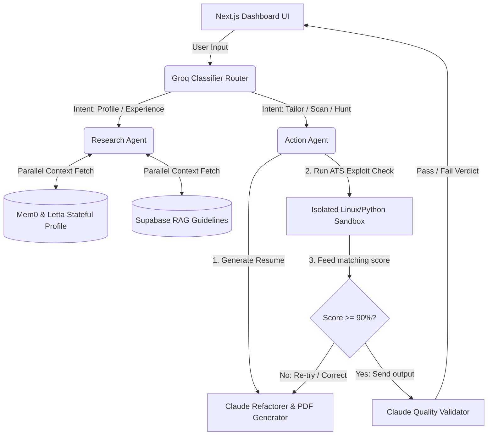

# Implementation Plan: ResumeVault AI — Autonomous Career Database & ATS Simulator

This plan outlines the architecture, roadmap, and step-by-step changes to turn our existing Agent Zero codebase into **ResumeVault AI**—a highly intelligent, personalized career command center. We will leverage **100% of our pre-built infrastructure** (Groq router, Mem0 memory, pgvector hybrid search, Claude validation loop, and the isolated Python sandbox) to create an absolute hackathon-winning application.

---

## User Review Required

> [!IMPORTANT]
> - **Sandbox Library Installation:** The isolated Python sandbox runs standard Python scripts. We will use a script that performs lightweight keyword extraction, structural validation (e.g., length, email format, section presence), and job compatibility scoring.
> - **Memory Collections:** We will reset the database collections during testing to ensure the fresh ResumeVault memory schemas are loaded correctly.

---

## Technical Architecture & "Secret Weapons"

To stand stronger than any other team, we are building four specific features that exploit our existing engineering setup:

### 1. Episodic Profiling (Mem0 + Letta)
Instead of a static text file, the user's career background is modeled as a stateful, episodic profile.
* **Mem0** captures user achievements, tech stacks, and career milestones dynamically during normal chat.
* **Supabase** acts as the permanent database vector index to match their raw experiences to job descriptions.

### 2. Sandbox-Powered ATS Engine (The Ultimate Wow Factor)
A Python simulator runs inside our **isolated remote sandbox container** to check how standard applicant systems parse the generated resume.
* It calculates a match rating based on job description keywords.
* It runs formatting validation (looking for hard-to-parse blocks, missing sections, and standard contact elements).
* It feeds the score and parsing recommendations back to the agent for self-correction.

### 3. Autonomous Job Hunting & Preparation (Scraper + Tavily)
The Action Agent uses:
* **Tavily Search** to discover active internship/job openings matching their profile.
* **Web Scraper** to extract the job requirements.
* It automatically generates the perfectly matching resume package.

---

## Proposed Changes

### Component 1: Prompts & Personas

#### [MODIFY] [agents.json](file:///c:/Users/shrey/OneDrive/Desktop/agentathonhackathon/agenthon_/orchestrator/config/agents.json)
Update agent personas to reflect their new specialized roles:
* **Router Agent:** Refines intents to distinguish between profile building (memory), job hunting (research), and resume tailing/scoring (action).
* **Research Agent:** Acts as an expert career coach, pulling facts from Mem0 and matching them to target job guidelines.
* **Action Agent:** Acts as a technical resume designer and ATS operator, planning tools execution, calling the sandbox validator, and drafting structured markdown/PDF files.

---

### Component 2: The ATS Sandbox Engine

#### [NEW] [ats_parser.py](file:///c:/Users/shrey/OneDrive/Desktop/agentathonhackathon/agenthon_/tools/ats_parser.py)
A Python script to run inside our secure container environment. It will parse a markdown/text resume, calculate keyword matches with the target job, verify standard sections (Education, Experience, Projects, Skills, Contact), and print a structured JSON report.

#### [MODIFY] [managed_agent_tool.js](file:///c:/Users/shrey/OneDrive/Desktop/agentathonhackathon/agenthon_/tools/managed_agent_tool.js)
Register the new ATS simulation script inside our tools runner so the Action Agent can trigger it autonomously.

---

### Component 3: Database & RAG Schemas

#### [MODIFY] [schema.sql](file:///c:/Users/shrey/OneDrive/Desktop/agentathonhackathon/agenthon_/supabase/schema.sql)
Ensure the `documents` table is primed to store resume templates, cover letter guidelines, and target job descriptions with 3072-dimensional embeddings.

---

### Component 4: Next.js Frontend Dashboard

#### [MODIFY] [page.tsx](file:///c:/Users/shrey/OneDrive/Desktop/agentathonhackathon/agenthon_/frontend/src/app/dashboard/page.tsx)
Redesign the existing dashboard UI into a premium, obsidian-themed career dashboard:
* **Left Sidebar:** Displays the dynamic "Memory Timeline" showing raw skills and achievements recalled from Mem0.
* **Center Chat:** Displays personalized responses, with clear visual cards showing tool executions (e.g., job scraped, resume compiled).
* **Right Sidebar:** Adds a stunning **ATS Live Score Meter** showing exact keyword density, structural rating, and sandbox validation logs.

---

## Verification Plan

### Automated Tests
* Run `node test_orchestrator.js` using career-related test cases to confirm proper routing and prompt synthesis.
* Run the mock ATS parser python script directly to verify accurate scoring.

### Manual Verification
* Chat with the agent on the Next.js frontend, add new projects, and verify they are stored in the memory stream in real-time.
* Paste a real job description and watch the validator loop dynamically trigger, self-correct, and present a high-scoring resume output.
